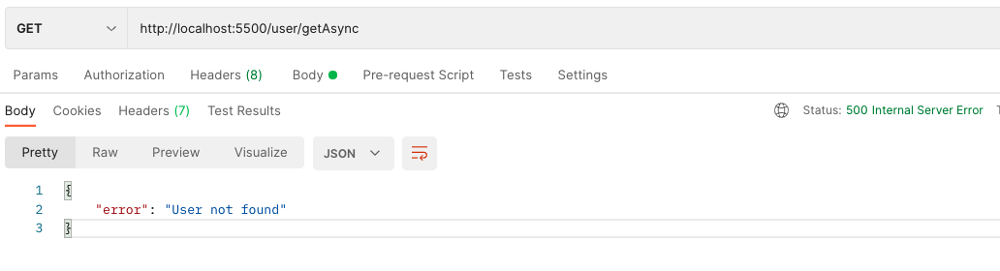

# Gestion des erreurs & asynchrones

## Asynchrones

Nous allons dans se repo manipuler les fonctions asynchrones.
Nous allons voir différentes façons de faire et nous allons élire la meilleure.

## Erreurs

Nous allons aussi en profiter pour manipuler les erreurs. Et ainsi nous allons élire le champion de la fonction.

## Installation

```shell
git clone <project>
cd <project>
npm install
```

## Outils
- Postman : https://www.getpostman.com/

Ou équivalent: insomnia, soapUI, Advenced Rest Client (ARC) etc.

## Exemple


